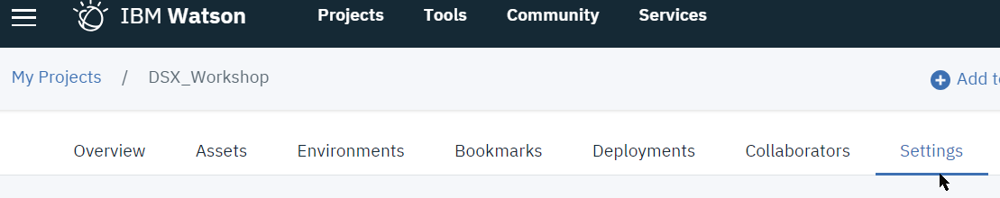
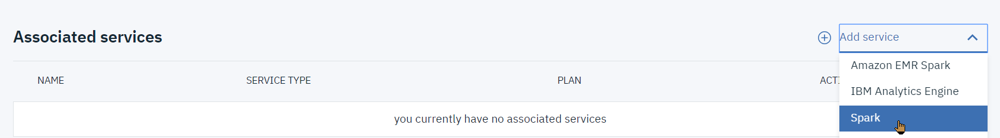
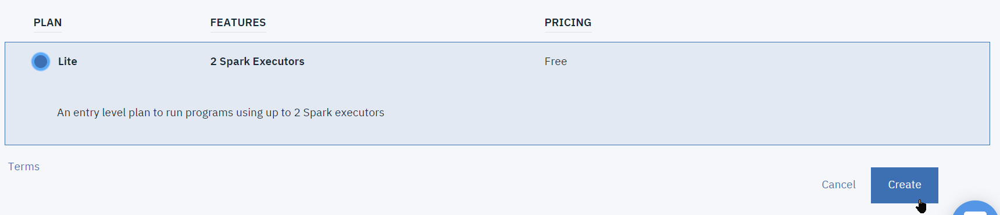
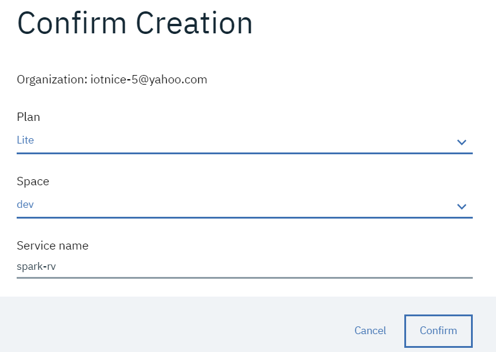
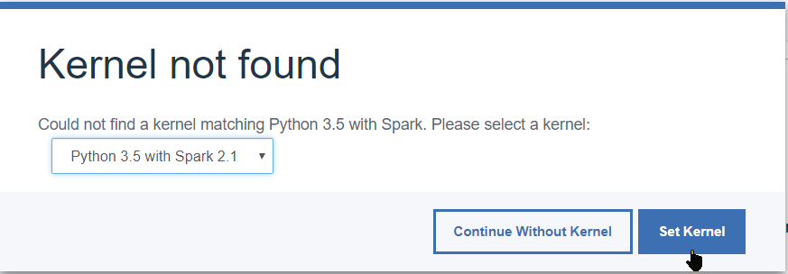
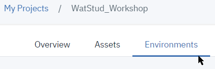
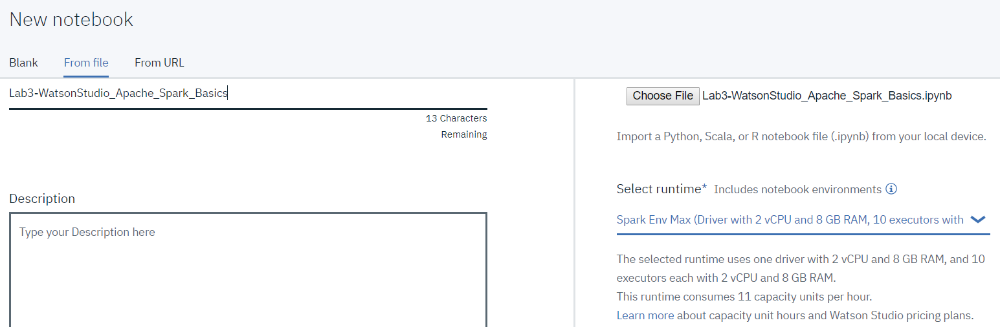
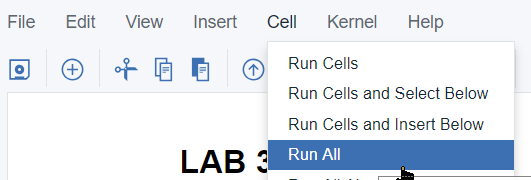
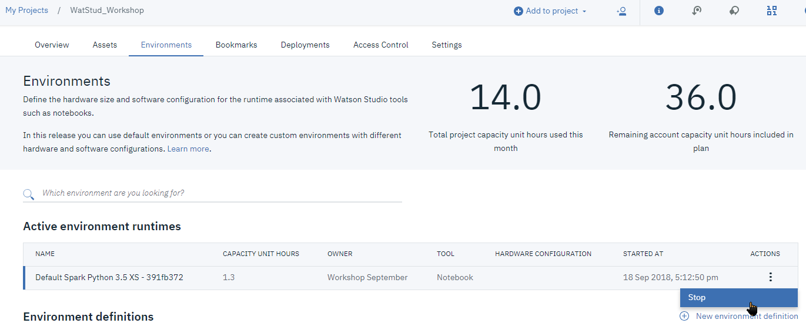

# Lab 3 - Spark
This hands-on lab section will be essentially driven by the instructions in the `Lab3-WatsonStudio_Apache_Spark_Basics.ipynb` notebook.

We will use a rather large (>1GB) data file, named `2017.csv`, retrieved from its source on the internet.
The first section of the notebook will fetch this file and store it into you Cloud Object Storage. It will then be added as Data Asset to the project.

## Setting up a Spark runtime for Watson Studio notebooks
There are several ways to execute a Spark workload from a IBM Waston Studio notebook. This is formally done by selecting a Kernel with Spark support, as opposed to a pure-Python Jupyter kernel which supports only Pandas DataFrames:
* Use an instance of an __IBM Analytic Engine__ (__IAE__).   
   The Lite configuration has 4vCPU and 16GB RAM, with up to 3 compute nodes, and a free allowance of 50 node-hours. This allocates a Hadoop/Spark environment, and the provisioning takes a bit of time (about 20 minutes).
* Use an instance of a __Apache Spark__ service.
  The Lite free configuration offers 2 Spark executors.
  > This service in its Lite/free configuration uses shared compute resources, so performance will depend of other users and is non-deterministic.
* Use a __Spark environement__ within Watson Studio.
  This does not require creating a separate service instance and allows various configurations which are charged per `Capacity Unit` (`CU`)-hours. The higher-spec the configuration, the more CU-hr are consumed.
  Watson Studio Lite currently comes with 50 free CU-Hr per month.
### Create a new runtime environment
For this lab, where we will be processing a rater large data file (1.13GB), representing 34,753,239 records and thus it is a good application for using an Apache Spark service.   
As a strech goal at the end of this lab, you will optionally setup a Spark Environment, so as to compare their relative performances.

### Spark Service engine setup
1. Switch to the `Settings` tab of your project 
1. scroll-down to the `Associated Service` section , select `Spark` from the `Add Service` pull-down menu.
1. Select the `Lite` pricing plan and `Create` 

>Note that if you created your **IBM Watson Studio** in the eu-gb region, you will need to make sure that the Spark service creation is in https://eu-gb.dataplatform.ibm.com  
1. Keep the defaults on the 'Confirm Creation' panel 
and select `Confirm`.  

You now have a Spark service associated to your project.

#### PixieDust and PySpark
The `Panda dataframes` that we have used in a previous lab are loaded in the Python address space of the Jupyter Notebook, and processed using their Python VM's compute resources.   

When dealing with larger datasets, **PySpark** is used to load data and run computations in a set of Spark executor instances, but there is no direct and easy way to handle some aspects of Spark dataframes handling such as visualization which usually has to be converted back to Pandas.   
**PixieDust** is designed to handle Spark DataFrames to provide interactive display capabilities for Spark DataFrames based on their structure, and then let the user interactively modify the visualization style to explore a dataset.

### Run the Hands-On through the notebook
1. Go to your `WatStud_Workshop` project, create a new notebook from the Assets tab: 
1. Use the `From file` option and select the `Lab3-WatsonStudio_Apache_Spark_Basics.ipynb` file.
1. Make sure you select a Spark runtime (usually named `spark-xy`) on the right-hand side: 
1. Start the notebook. If you encounter a **Kernel Not Fonud** panel, select `Python 3.5 with Spark 2.1` kernel and continue with `[Set kernel]`: 
1. Follow the instructions within the notebook.   
   * You will notice some timing instructions, most of which are not very relevant when running the notebook in interactive mode.
   * The notebook downloads the file from its source if it is not already present in COS.

## Stretch Lab: Using a Spark Environment
We will compare the performance of Spark environments and Apache Spark service:
### Create a new Spark Environments
1. Switch to the `Environment` tab in your project: 
1. Select 
1. Create a configuration for Spark with 10 Executors, 2vCPU/8GB RAM hardware configuration for Driver and Executor, and name it e.g. `Spark Env Max`: 
### Execute the notebook again with the environement:
1. Create a notebook from the `Lab3-WatsonStudio_Apache_Spark_Basics.ipynb` file, making sure to specify your newly created environment: 
   You will notice the per-hour cost of the environment at 11 CU.
2. Run the notebook (You may have to set the kernel again). You can use the `Cell/Run All` menu 
3. Compare the execution times to the previous notebook run with Apache Spark service:
   * Only the RDD or SQL operations are really relevant
   * There is roughly a factor two between the two Spark setups, compare for example `J_Begin/EndCountSnowDays`, or `K_Begin/EndCountSnowDays`.
   * RDD operations are closer in timing than SQL operations.

>**NOTE:** To avoid using up your free runtime credit, it is advisable to shut down the Spark notebook kernel after you'll have completed this lab:
The free allotment is 50 CU (Capacity Unit) per month, the Spark XS environment uses 1.5 CU per hour.
1. Switch to the `Environments` tab in your project, locate the running instances of environments, and select `[Stop]` button:
  
