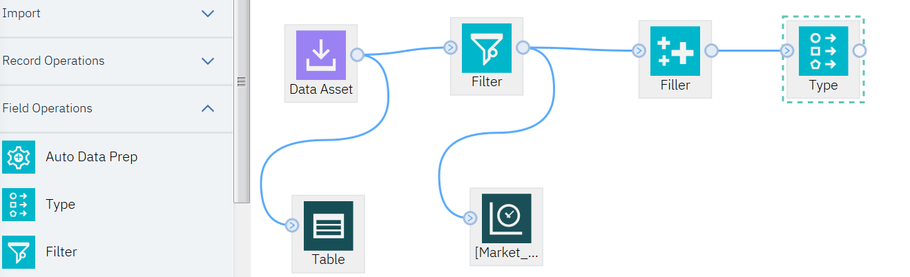
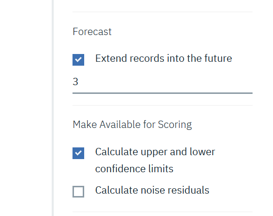
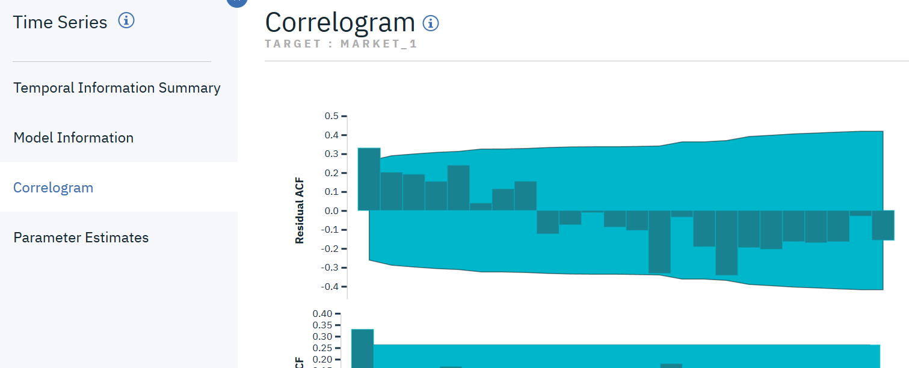

# Lab 4 - TimeSeries 

**Forecasting bandwidth utilization with the Time Series Node in Flow Modeler**

## Overview
An analyst for a national broadband provider is required to produce forecasts of user subscriptions in order to predict utilization of bandwidth. Forecasts are needed for each of the local markets that make up the national subscriber base. We will use time series modeling to produce forecasts for the next three months for a number of local markets.
The source file we'll be using has time series data for 85 different markets, although for the sake of simplicity you will only model five of these markets, plus the total for all markets.

The broadband.csv data file has monthly usage data for each of 85 local markets. For the purposes of this example, only the first five series will be used; a separate model will be created for each of these five series, plus a total.

The file also includes a date field that indicates the day, month and year for each record. This field will be used in a Time Intervals node to label records.

The Time Series node requires that each series be in a separate column, with a row for each interval.
## Preparation
Download the broadband.csv file.
Add the file to the data assets for the project : click New data asset, click browse, select the broadband.csv file and click Open.
## Modeler Flow creation
Navigate to Modeler flows and click New flow.

Type a name and a description, select Modeler Flow and IBM SPSS Modeler for the flow type.

Then click on Create.
The Flow Editor will open.
Drag&Drop the Data Asset icon from the Import nodes into the canvas.

Double-click the data asset icon and select change data asset.

Select the broadband.csv file and click on OK at the bottom right.

Click on the Save button at the bottom right.
Now we will add a table output in order to be able to view the contents of the broadband.csv file.
Drag&Drop the Table icon from the Outputs node into the canvas.

Wire the Table node to the Data Asset node by hovering the circle at the right of the Data Asset node, clicking the highlighted area and then dragging the connector to the Table node.

Click on the Run button at the top of the canvas to run the actual flow.
Once you run the model you will be able to see the contents of the table in the Outputs tab on the right.

You can notice that the table contains 89 fields and 60 records.
Double click on this table in the Outputs.

You can see the contents of the table, in fact the contents of the broadband.csv file.
The fields represent the 85 local markets, plus a Total field, a field for the year, a field for the month and a field for the date.
There are sixty records (5 years of monthly data).
We only want to analyze the first five local markets, plus the total for all markets.
We will use a Filter node to filter out the Market_6 to Market_85 fields and the MONTH_ and YEAR_ fields to simplify the model.
Click on the flow name to go back to the canvas.
Drag&Drop the Filter icon from the Field Operations nodes into the canvas.

Wire the Filter node to the Data Asset node.

Double click the filter node to select the fields we want to retain.
Select Retain the selected fields.

Click on Add Columns.
Select Market_1, Market_2, Market_3, Market_4, Market_5, Total and DATE_ fields and click on OK.

Click on Save.

## Examining the Data
It is always a good idea to have a feel for the nature of your data before building a model. Do the data exhibit seasonal variations?
You can often obtain faster results by limiting the search to nonseasonal models when seasonality is not present in your data.
Without examining the data for each of the local markets, we can get a rough picture of the presence or absence of seasonality by plotting the total number of subscribers over all five markets.
To do that we will use a Time Plot node.
Drag&Drop the Time Plot icon from the Graphs nodes into the canvas.

Wire the Time Plot node to the Filter node.

Double click the Time Plot node to edit the settings.
Click on Add Columns.

Select the Total field and click on OK.

Deselect the Display series in separate panels and Normalize check boxes, then click on Save.

Click on the Run button.
In the Outputs section, double click on the Total line.

The graph for the Total field is displayed.

The series exhibits a very smooth upward trend with no hint of seasonal variations. There might be individual series with seasonality, but it appears that seasonality is not a prominent feature of the data in general.
Now we will inspect each of the series to look for some seasonality.
Go back to the canvas by clicking on the flow name.
Double click the Time Plot node to edit the settings.
Remove the Total field by selecting Total in the list and clicking on -.

Then click on Add Columns, select Market_1, Market_2, Market_3, Market_4 and Market_5 fields and click on OK.

Click on Save, then click the Run button.
In the Outputs section, double click on the [Market_1 ... Market_5] line.

The graph for the 5 markets is displayed.

Inspection of each of the markets reveals a steady upward trend in each case. Although some markets are a little more erratic than others, there is no evidence of seasonality to be seen.
## Defining the dates
Now we need to change the storage type of the DATE_ field to Date format.
To do that we will use a Filler node.
Drag&Drop the Filler icon from the Field Operations nodes into the canvas.

Wire the Filler node to the Filter node.

Double click the filler node to edit the settings.
In the Fill in fields section, click on Add Columns.

Select the DATE_ field and click on OK.

Set the Replace condition to Always.

Set the value of Replace with to to_date(DATE_).

Then click on Save.
## Defining the targets
We will use a Type node to set the role to None for the DATE_ field and Target for all others (the Market_n fields plus the Total field).
Drag&Drop the Type icon from the Field Operations nodes into the canvas.

Wire the Type node to the Filler node.

Double click the Type node to edit the settings.
Click on Configure Types.

Click on Add Columns.

Select all the fields and click on OK.

Set the role to Target for all the fields, except for the DATE_ field, and click on OK.

Click on Save.
## Creating the model
We will use a Time Series model.
Drag&Drop the Time Series icon from the Modeling nodes into the canvas.

Wire the Time Series node to the Type node.

Double click the Time Series node to edit the settings.
In FIELDS, select the Use custom field roles check box.

Click on Add Columns for Targets.

Select all the fields, except the date, and click on OK.

Click on OBSERVATIONS AND TIME INTERVAL.

Select DATE_ for the Time/Date Field.

Select Months for the Time Interval field.

Click on MODEL OPTIONS.

Select the Extend records into the future check box and set the value to 3.

Click on Save.
Then you can run the model by clicking on the run icon.
Once you run the model you will be able to see it in a golden color node.

In order to be able to view the predicted values, we will use a Table node.
Drag&Drop the Table icon from the Outputs node into the canvas.

Wire the Table node to the Time Series golden node.

Run the model by clicking on the run icon.
Once you run the model, you can notice that there is a new table in the Outputs section. This table contains 63 records. There are now three new rows (61 through 63) appended to the original data. These are the rows for the forecast period, in this case January to March 2004.
Double click on this new table to view its contents.

Several new columns are also present now : the TS- columns added by the Time Series node. The columns indicate the following for each row (i.e., each interval in the time series data):
TS-colname : The generated model data for each column of the original data.
TSLCI-colname : The lower confidence interval value for each column of the generated model data.
TSUCI-colname : The upper confidence interval value for each column of the generated model data.
These columns in rows 61 through 63 contain the user subscription forecast data and confidence intervals for each of the local markets.
## Examining the model
Click on the flow name to go back to the canvas.
Right-click the Time Series model nugget and select View Model to display data about the models generated for each of the markets.

You can see the modeling methods used for each of the markets.

The remaining columns in this view show various goodness-of-fit measures for each model.
The STATIONARY R SQUARED column shows the Stationary R-squared value. This statistic provides an estimate of the proportion of the total variation in the series that is explained by the model. The higher the value (to a maximum of 1.0), the better the fit of the model.
 The R-squared value is an estimation of the total variation in the time series that can be explained by the model. As the maximum value for this statistic is 1.0, our models are fine in this respect.
 RMSE is the root mean square error, a measure of how much the actual values of a series differ from the values predicted by the model, and is expressed in the same units as those used for the series itself. As this is a measurement of an error, we want this value to be as low as possible. At first sight it appears that the models for Market_2 and Market_3, while still acceptable according to the statistics we have seen so far, are less successful than those for the other three markets.
 MSE is the mean square error. It also assesses the quality of a predictor. Again it appears that the models for Market_2 and Market_3 are less successful than those for the other three markets.

 We can see more details for each model by clicking in the last column (ACTIONS).
 Click in the ACTIONS column for Market_1.

 

 Click on Model Information.

 

 You can find in the table more details on the model.
 The MAE (mean absolute error) value shows the mean of the absolute values of the forecast errors. Like the RMSE value, this is expressed in the same units as those used for the series itself.
 MAXAE shows the largest forecast error in the same units and indicates worst-case scenario for the forecasts.
 MAPE is the mean absolute percentage errors and MAXAPE is its maximum value. Absolute percentage error is a measure of how much a target series varies from its model-predicted level, expressed as a percentage value. By examining the mean and maximum across all models, you can get an indication of the uncertainty in your predictions.

 The df column relates to the Ljung-Box statistic, a test of the randomness of the residual errors in the model--the more random the errors, the better the model is likely to be. df (degrees of freedom) indicates the number of model parameters that are free to vary when estimating a particular target.

Click on Correlogram.

This allows to display the values of the autocorrelation function (ACF) and partial autocorrelation function (PACF) for the residual errors.
In these plots, the original values of the error variable have been lagged by up to 24 time periods and compared with the original value to see if there is any correlation over time. For the model to be acceptable, none of the bars in the upper (ACF) plot should extend outside the shaded area, in either a positive (up) or negative (down) direction.
If a bar is outside the shaded area, you would need to check the lower (PACF) plot to see whether the structure is confirmed there. The PACF plot looks at correlations after controlling for the series values at the intervening time points.

Display these details for the other markets (Market_2 to Market_5).
## Displaying the forecasts
We will use a Time Plot node to display the forecasts.
Click on the flow name to go back to the canvas.
Drag&Drop the Time Plot icon from the Graphs nodes into the canvas.

Wire the Time Plot node to the Time Series golden node.

Double-click the Time Plot node to edit the settings.

Click on Add Columns.

Select Market_1 and TS-Market_1 and click on OK.

Uncheck Display series in separate panel and click on Save.
Run the model.
Double click on the Time Plot line in the Outputs.

The graph is displayed.

Notice how the forecast ($TS-Market_1) line extends past the end of the actual data. You now have a forecast of expected demand for the next three months in this market.
Go back to the canvas by clicking on the flow name and double click the Time Plot node to edit the settings.

Click on Add Columns.

Add TSLCI-Market_1 and TSUCI_Market_1 and click on OK.
Click on Save.
Run the model.
Double click on the Time Plot line in the Outputs.

The graph is displayed.

Notice how the boundaries of the confidence interval diverge over the forecast period, indicating increasing uncertainty as you forecast further into the future.
