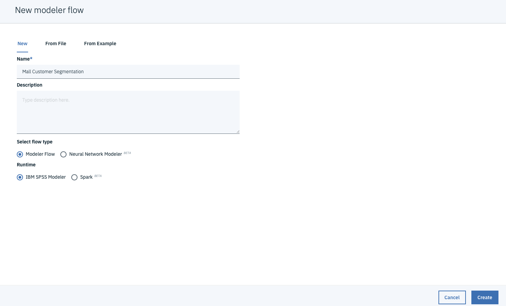
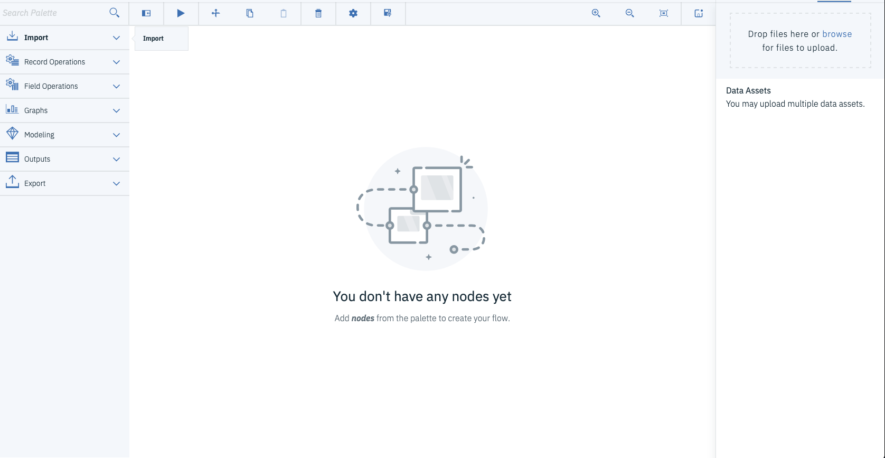
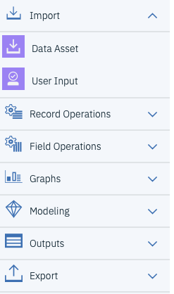
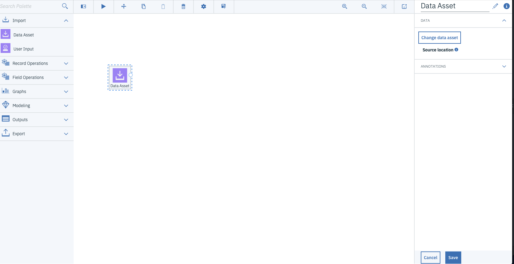

# Mall Customer Segmentation

In this tutorial we are using Watson Studio's SPSS Modeler to cluster Mall customer data and Visualize predictions with Data refinery.

We are using sample dataset, which can be found from Kaggle:

[Data](https://www.kaggle.com/vjchoudhary7/customer-segmentation-tutorial-in-python "Data")

Download the dataset and import that as a data asset to Watson Studio Project. If you aren't familiar with Watson Studio, please see my first Lab:

[Lab1-Getting Started](https://github.com/LasseHuotari/WatsonWorkshop/tree/master/Lab1-GettingStarted "Lab1-Getting Started")

When you have loaded the dataset open new Modeler Flow from the asset page.

or if you haven't created Modeler flow earlier press **add to project** from top part of the assets page.

after that click **Modeler Flow** from pop-up window.

After that name your flow and check that all the settings are like in the picture below. Then press **create**

After this you should see a empty canvas like this:

Great. Now let's add some nodes to the canvas. First thing what we need is the **data asset** node. You can find this node under the **import** dropdown from the left side of the canvas.

Drag & Drop that node to the empty canvas and douple click the node. This will open the node setting panel to the right-hand side.

Press **Change data asset** and open the **data assets** panel and choose the **Customer Mall segmentation dataset**. Pres **OK** and then **Save**.

