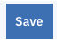

# Mall Customer Segmentation

In this tutorial we are using Watson Studio's SPSS Modeler to cluster Mall customer data and Visualize predictions with Data refinery.

We are using sample dataset, which can be found from Kaggle:

[Data](https://www.kaggle.com/vjchoudhary7/customer-segmentation-tutorial-in-python "Data")

Download the dataset and import that as a data asset to Watson Studio Project. If you aren't familiar with Watson Studio, please see my first Lab:

[Lab1-Getting Started](https://github.com/LasseHuotari/WatsonWorkshop/tree/master/Lab1-GettingStarted "Lab1-Getting Started")

## Modeling the data

When you have loaded the dataset open new Modeler Flow from the asset page.

or if you haven't created Modeler flow earlier press **add to project** from top part of the assets page.

after that click **Modeler Flow** from pop-up window.

After that name your flow and check that all the settings are like in the picture below. Then press **create**

After this you should see a empty canvas like this:

Great. Now let's add some nodes to the canvas. First thing what we need is the **data asset** node. You can find this node under the **import** dropdown from the left side of the canvas.

Drag & Drop that node to the empty canvas and douple click the node. This will open the node setting panel to the right-hand side.

Press **Change data asset** and open the **data assets** panel and choose the **Customer Mall segmentation dataset**. Press **OK** and then **Save**.

Next thing to add to canvas is **data audit** node from outputs panel. With this node we make sure that our data quality is good.

Drag and Drop the **data audit** node to the canvas and connect the **data asset** node to **data audit node**

Next Thing is to run the flow. To do that press **play**

Outputs panel should open, next douple click the **5 fields** node from outputs panel to open the data audit results.

Now you should see data audit raport. Take few seconds to explore the raport. As you see the data quality is good and we don't have empty rows.

Now click the Modeler Flow name on the top of the raport to return back to the canvas..

Now Let's build the model itself. First thing is to insert **Type** node. You can find that under the **Field operations** dropdown. Drag and Drop **Type** node to the canvas and connect that to **data asset** node. Douple click the **Type** node from the canvas to open the node settings and choose same options as shown below and press **save**. We are not using Gender as a feature or customer ID since Customer ID is different to every single customer and Gender reduces the model performance.

Next thing is to add the actual model itself. We are going to use **K-Means** clustering and you can find the node for that under the **modeling** operations. Drag and drop the **K-Means** node to the canvas and connect that to the **Type** node. Then douple click the **K-Means** node to open the model settings. From model settings open the **Build options** panel and Change the **number of clusters** to **8**. Then click **Save**

After this let's train the model. To run only the modeling branch right-click **K-Mesns** node and press **run**

To check how your model performed right click the **golden node** that append to the canvas and press **view model**

Explore the model performance and when you are ready click the modeler flow name in the upper part of the page to return back to the canvas.

After this let's export new dataset with the predictions so we can visualize that. To Export dataset from modeler we are going to use **Data Asset Export** node which can be found from **Export** Operations. Drag and drop that node to canvas and connect that to the **golden model** node. After this douple click the **Data Asset Export** node and name the new exported file in **Target path** field as shown below. and press **Save**

After this run the flow by right-clicking the **Data Asset Export** and pressing the run button.

After the run is completed go back to the project's assets page.

## Visualizing the data

Locate your exported data asset from **Data Assets** section annd click the actions. From dropdown choose **Refine**.

Since our dataset is so small Data Refinery can show all data points. To Visualize the data choose the **visualization** tab.

Choose 3D visualization from visualization menu.

And then select **Age** to **X-axis**, **Annual Income (k$)** to **y-axis**, **Spending Score (1-100)** to **Z-axis** and for the **color map** select **$KM-K-Means**

Now you should see the visualizated results from your clustering model. As you see each cluster represnts their own group of customers and customers can be divided within these clusters. This can be used to promote different campaigns or to give personalized offers.
