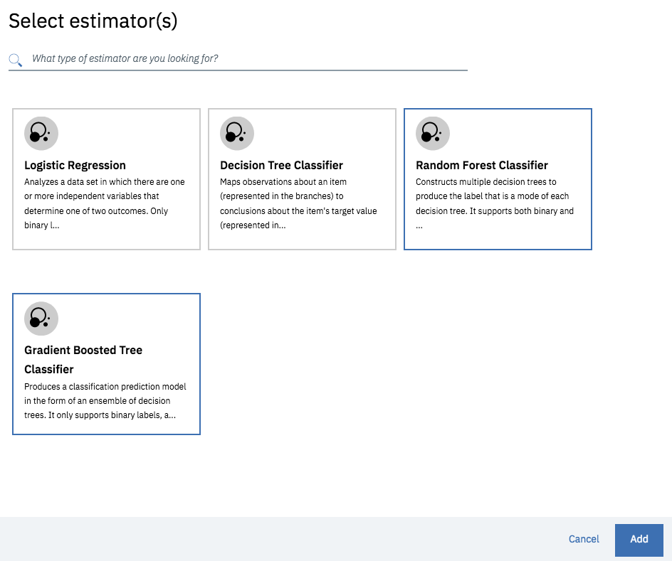
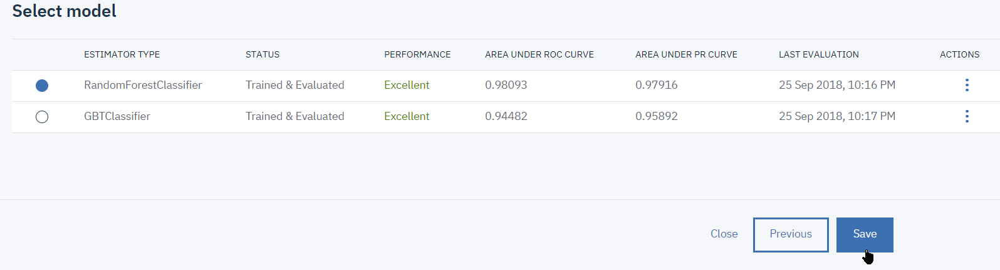
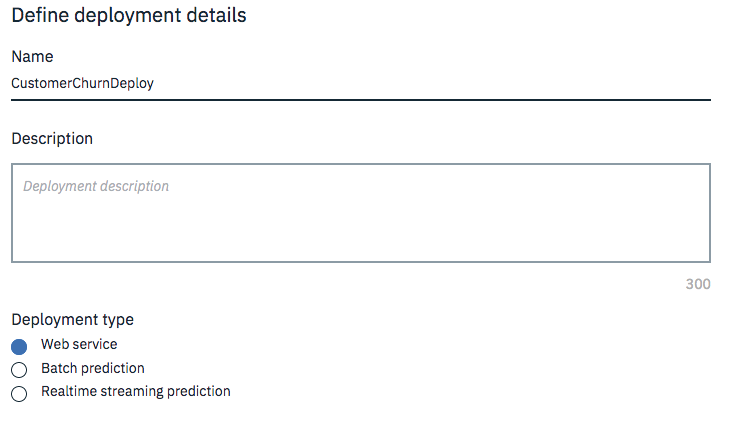
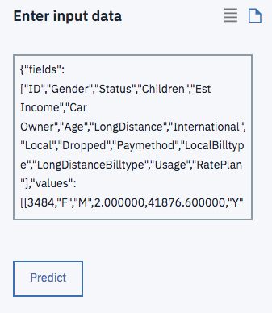
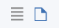

# Lab5 part 1: Introduction to Machine Learning with Watson Studio

**Build train, and deploy a machine-learning model without coding and invoke it from a notebook**

Get experience with **IBM Watson Studio** by creating a decision-tree machine-learning model to evaluate the risk that a customer might leave your service.

**Duration:** 20 minutes

**Experience:** clicker + optional coder

In this tutorial, you use **IBM Watson Studio** to train and deploy a machine-learning model without any coding or manual model building skills.

You complete the following tasks:
  * Create a project (unless you have already an existing project)
  * Load a data set into the project
  * Use the IBM Watson Studio model builder to train, test, and evaluate a machine-learning model
  * Deploy the model

## Prepare a project in IBM Watson Studio
In IBM Watson Studio, data scientists work and collaborate in projects. In this task, you set up a project.

---
> **If you have already completed previous labs on IBM Watson Studio, jump directly to the Assets section on bullet 7.**
---
1. Go to **<https://dataplatform.cloud.ibm.com>** to access IBM Watson studio cloud-based service.

2. Click **Login** and provide your IBM ID credentials.

3. When logged in to IBM Watson Studio the first page that you see is the **Get started with key tasks** which helps you to get a customizable user experience whether you are a data scientist, a data engineer... You can minimize this pane clicking **Hide**.
If you scroll, you can explore the **Community Page** where you can distribute public assets, such as notebooks and data sets, which can be used by any IBM Watson Studio user. Community page is also a great way to grow your data scientist skills.

4. In the upper-right corner, click the **+ New Project** link, to create project. Alternatively you can use an existing project.
The "New project" page opens and lists a set of templates (tiles) which tailor the tools based on the tasks you want to accomplish.
Select **Modeler**.

5. Give your project a name, let's say `CustomerChurn`, a detailed description.

6. Click **Create**.
On the project's summary page, you can see that the project has no assets.

7. Click **Assets**.
The various project components are shown, such as notebooks, models, and data sets. You're going to add a data set to the project.

8. **Data sets** can be local or remote. In this tutorial, you work with a small local data set.

**Click the Find and add Data** icon which looks like a 10 01 button. It will open the file management sidebar.

9. From the **Load** tab, Click **Browse** to select from your local file system.
Navigate to the lab files folder (given by your instructor) and select `customer_churn.csv`  and click **Open**.
Alternatively, you can drag and drop a file directly into the sidebar.
The file is added to your local data sets in your project.

Next, you will create a machine-learning model by using this newly loaded data set.

## Create the model
Create a model by using the IBM Watson Studio model builder.

1. Scroll to the **Models** section of the project.
   A project can host several models of different types:
   + Natural Language Classifier models
   + Visual Recognition models
   + Watson Machine Learning models
1. Click **+ New Watson Machine Learning Model**: 
On the New Model page, the `Model builder` model type is selected by default.
Give a name to the model, `customerchurn` for example.
The model builder can be fully automated or can leave certain steps to be completed manually. In this tutorial, you use the manual option so that you can review the capabilities of the model builder.
1. An **IBM Watson Machine Learning Service** is required:
   1. Click on  `Associate a Machine Learning service instance` 
   1. Create a new Lite/Free plan instance: 
   1. Once created, switch back to the model creating tab and click `[Reload]`  to select your newly created instance.
1. Make sure you have selected A **Spark Service**
1. Click **Manual** to get more options in data selection for training your model: 
1. Click `[Create]`
1. On the "Select data asset" page, you can select the data asset to use to create your model.
   * Use the  button to upload `customer_churn.csv`
   * then select it and click **Next**. 
1. On the "Select a technique" page, you select the attributes of the machine-learning model.
From the **Column value to predict (Label Col)** list, select **CHURN**. This is the column that contains the historical observations and thus the outcome to predict.
The **Feature columns** are columns that contain the attributes on which the machine learning model will base predictions. All columns (features) are selected by default, you can leave it as-is or select **all BUT the ID column**.
1. The model builder selects **Binary Classification** by default as the type of model to build. Because you want to create that type of model, leave the selection as-is.
1. In the upper-right corner, click **Add Estimators** to select the type of machine-learning algorithm to train.
1. On the "Select estimator(s)" window, from among the four algorithms, click **Random Forest Classifier** and **Gradient Boosted Tree Classifier**. Click **Add**.
   > The estimators (machine-learning algorithms) are shown on the next page, where you can also modify the percentage split between training, testing, and validation sets. Leave the default settings as-is.

   
1. Click **Next**.
   The two models are trained and their respective evaluations are displayed. Depending on  the way the test set has been (randomly) spliced, either one of the estimators will come out with slightly better performance results.
   
   The ROC (Receiver Operating Characteristic) and PR (Precision Recall) Area Under Curve (AUC) are metrics used to evaluate the accuracy of a model's true positive and true negative predictions, evaluated on the test subset.
1. Select the `RandomForestClassifier` and click **Save**. When you're prompted to confirm, click **Save** again.
You're returned to the **Models** summary page, on the **Overview** tab, where your new model is listed.

You now have a trained model, next you will deploy the model to test on out-of-sample data.

## Deploy and test a trained model
Before you can use your trained model to make predictions on new data, you must deploy the model. It's time to deploy the model and start to score a few records.

1. From the model summary page, click the **Deployments** tab.
1. Click **Add Deployment** link on the upper-right section of the pane 
1. On the **Create Deployment** page, give a name and a description to your deployment, say `CustomerChurnDeploy`.
   > Note that deployments must have a unique name.

   

1. By default **Web service** is selected as the deployment type. Click **Save**.
   > **Batch prediction** and **Realtime streaming prediction** are deployment types for continuous learning and model evaluation. For **Batch Prediction** source could be a file in your **IBM Cloud Object Storage** or a connection and table from **IBM DB2 Warehouse on Cloud**.
   For **Real-time Streaming** the source is a streaming data source from a **Message Hub** instance.

1. When model deployment is complete, from the **Actions menu**, click **View**. Alternatively you can click on the Deployment name. The **Deployment Details** window appears.
1. Click on the **Implementation** tab. Note the scoring end point for future reference. **You can only have one deployment per user**.
   > The **Code Snippets** are available to pass it on to you application developer to integrate the deployed model into a business application.

   

1. Now is a good time to test the model prediction. Go to **Test** tab.
1. Enter data in all the fields for a sample record from the data set.

   Get data from the `new_customer_churn_data.csv` file or copy the data from here and paste into the `Input JSON Payload data`:
``` JS
{"fields":
["ID","Gender","Status","Children","Est Income","Car Owner","Age",
"LongDistance","International","Local","Dropped","Paymethod",
"LocalBilltype","LongDistanceBilltype","Usage","RatePlan"],
"values":[
[3484,"F","M",2.000000,41876.600000,"Y",44.093333,
6.780000,0.000000,132.650000,0.000000,"CC",
"FreeLocal","Standard",139.440000,4.000000]
]}
```
   

9. To test the model click **Predict**: 
   Here the prediction is that customer will not churn at 86% chance.
1. You can test several out-of-sample records provided as a payload in JSON format. Click on the **document** icon.
  
  Copy-paste the JSON from a text editor and click **Predict**.
The results of scoring the tuple (tuples) against the model are shown either in raw data format or as an output chart.
