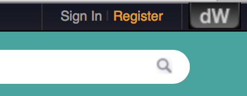
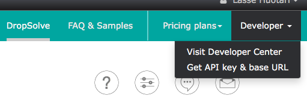
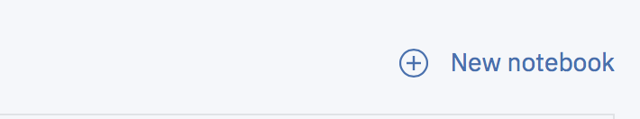
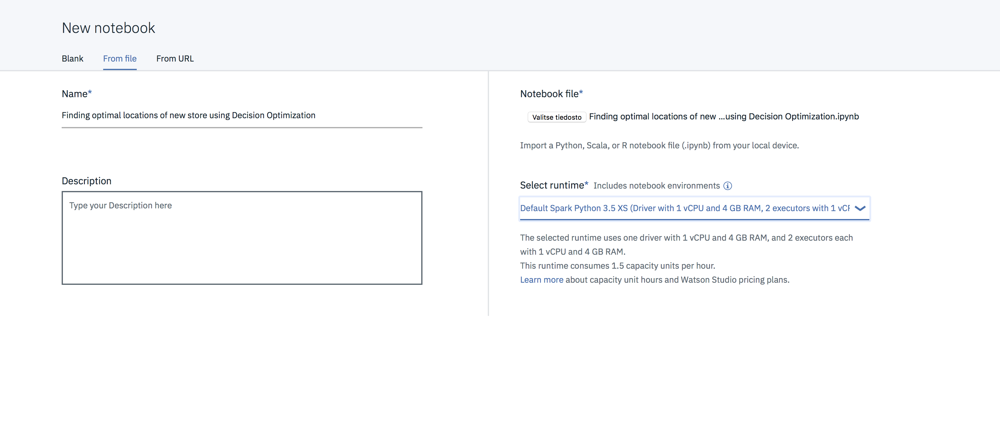

# Lab 6 - Optimization

In this lab we are learning how to do basic optimization with CPLEX and Jupyter Notebook. To complete lab you need to sign up for trial period in **Decion Optimization on Cloud service**.

1. You can sign up to **Decion Optimization on Cloud service** go to https://developer.ibm.com/docloud/ and press register button which is located to top-right corner. Use your IBMid. The trial period lasts two months.

2. After registration you need to save your API url and API key. Signin and click **Developer->Get API Key and base URL**

3. Copy those and press **new notebook** button in **Project Asset** page in **Watson Studio project**.

4. Find **.ipynb** file from box folder named **Finding optimal locations of new store using Decision Optimization.ipynb**

5. Select **Default Spark Python 3.5 XS** as a runtime

5. Follow the instructions in notebook.
