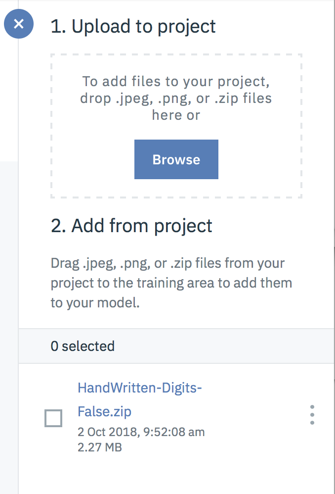

# Watson Studio - Visual Recognition 

## Handwritten digit recognition using IBM Watson Studio & Watson Visual Recognition service for non Data Scientist.

This tutorial shows IBM Watson Studio framework capabilities to create your own image classification service leveraging Watson Visual Recogniton Service.
 
Watson Visual Recogniton Service is a pre-trained neurla network exposed as a service that you can enrich & customize with your own classifiers.

## Introduction
Watson Studio provides you with the environment and tools to solve your business problems by collaboratively working with data. You can choose the tools you need to analyze and visualize data, to cleanse and shape data, to ingest streaming data, or to create, train, and deploy machine learning models.

This illustration shows how the architecture of Watson Studio is centered around the project. A project is where you organize your resources and work with data.

##  Step 1 - Create your Classifier

Once logged in the Wastson Studio platform within a project and from the Asset tab of your project click on add a new VisualRecognition Model as shown hereafter

You're now ready to start writing your own Visual Recognition classifier.

if you haven't created a Watson Visual Recognition Service yet you will be asked to do so

Then create your new visual Recognition Classifier from the screen below

##  Step 2 - Load your training data

From the repository add the 2 data sets created for you

HandWritten-Digits-False.zip contains 100+ images of various handwritten digits (except for digit 4) and false handwritten samples as well.

HandWritten-DIgit-4.zip contains 30+ samples handwitten digit 4 samples.

We will use this 2 files to create our classifier to recognize a 4.

First upload the 2 files by using the drag & drop upper right corner

Once done drag & drop the uploaded files onto the center Negative Box as shown hereafter

Then create a new class called.... whatever you want ;) Handwritten4 class4 or Digit4 for example.
in a nutshell this classifier will recognize handwritten digit 4.

and add using "drag and drop", drop the second file called to the newly created class as shown hereafter.

##  Step 3 - Train your Classifier

Guess what you're ready to train you classifier !
Click on the upper right corner "Train" button

Take a break the cloud Visual Recognition service is working for you to train your classifier 
Depending on your subscription fee this can take seconds or minutes.

##  Step 4 - Test your Classifier

Once done, click on the test button to experiment your newly created classifier to recognize digit 4.

As you can see there is a notion of threshold here which is something you nedd to assess & adjust based on your test/validation results using fresh data (not used for the training process).
This threshold represent the confidence level that you except for your classifier.

you can test it by dragging the file test4.jpg or testFalse.jpg provided in the Lab folder you should get something like the following screenshot

Congratulations you're a practitioner in Deep learning

Look at the next lab to become a master !

Please feel free to share this tutorial and provide me with your remarks, questions, I would appreciate

[LinkedIn](http://fr.linkedin.com/pub/jean-luc-collet/9/541/740)

Thanks !

Jean-Luc Collet
July 11, 2018